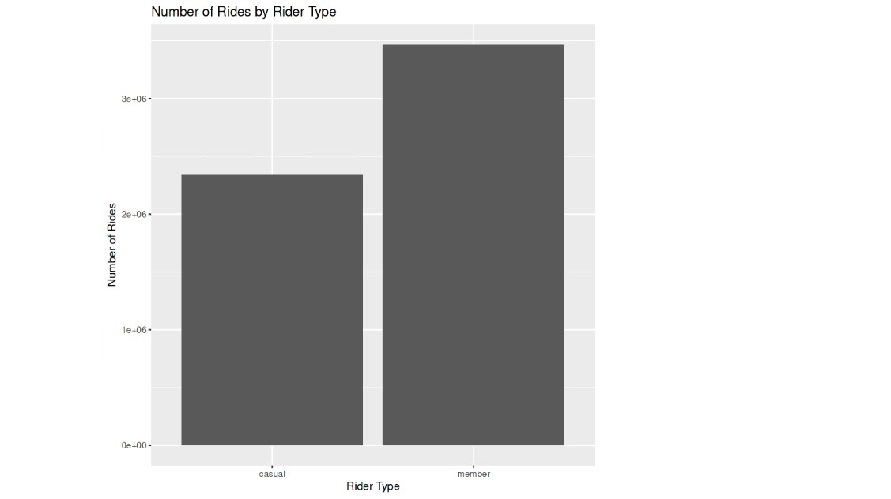
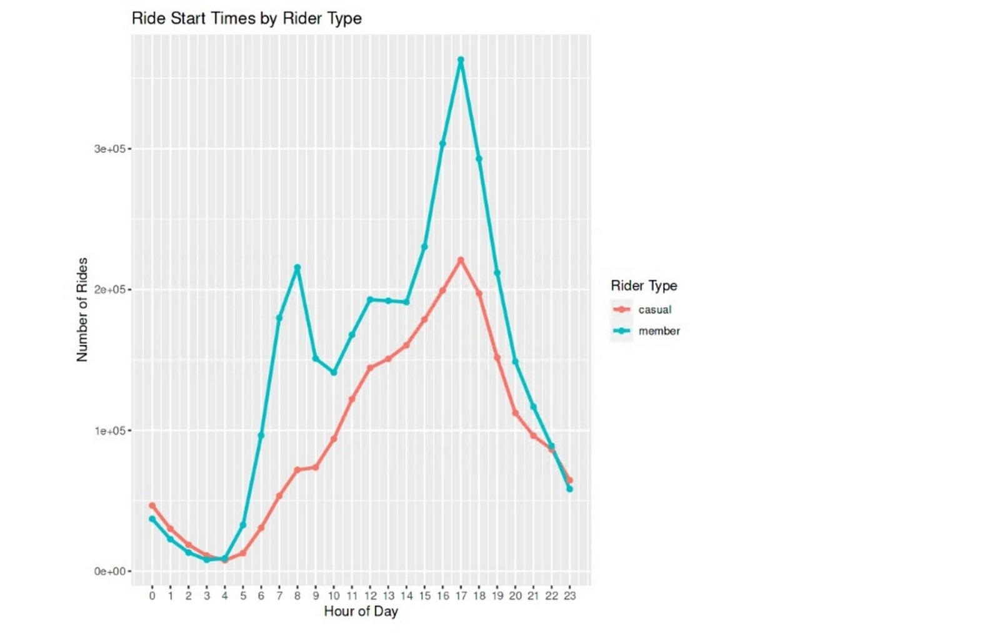
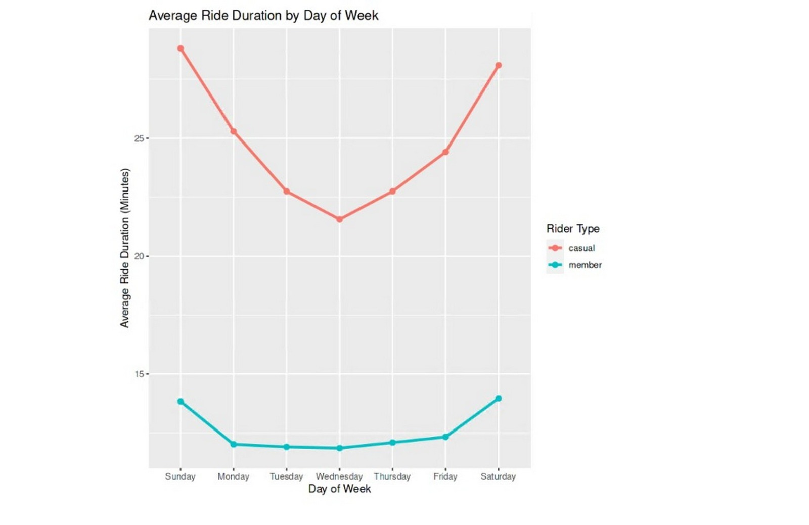
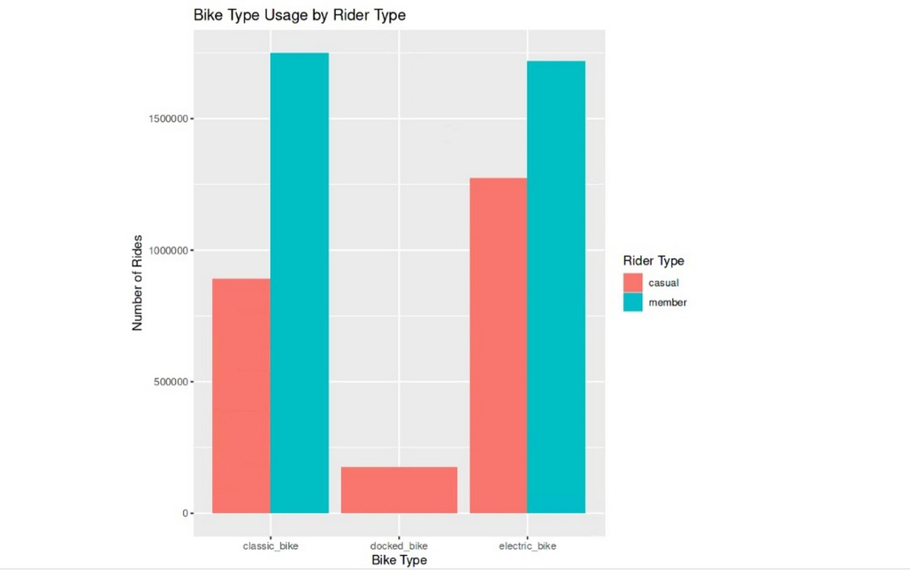
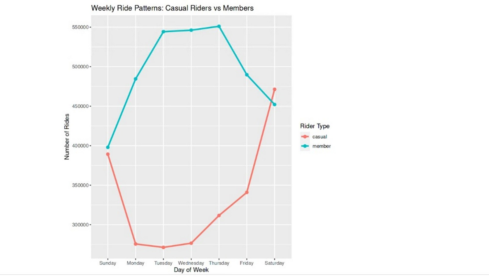

# Cyclistic Bike-Share Case Study

An analysis of Cyclistic, a bike-share company in Chicago, exploring how annual members and casual riders use the service differently — with the goal of informing a marketing strategy to convert casual riders into members. The analysis covers 12 months (April 2022 to March 2023) of Cyclistic trip data and combines data cleaning, modeling, business analysis, and dashboard storytelling.

This project was done on Kaggle , kindly use the link to access it [Kaggle Notebook](https://www.kaggle.com/code/troleen/cyclistic-bike-share-analysis)

## Table of Contents
- Business Question
- Data Source
- Tools Used
- Process
- Key Findings
- Recommendations
- Dashboard

## Business Question

Key question: In what ways do members and casual riders use Divvy bikes differently?
Understanding these differences is intended to help shape a marketing strategy aimed at converting casual riders into annual members.

## Data Source

12 months of Cyclistic trip data (April 2022 – March 2023), made available via Kaggle: Cyclistic Bike Share Apr'22 - Mar'23 Dataset
Each monthly file contains ride-level records including ride ID, bike type, start/end times, station names, and rider type (member vs casual).

## Tools Used
- R (via Kaggle Notebooks)
- tidyverse (dplyr, ggplot2, lubridate, etc.) for data wrangling and visualization
- Power BI for additional/extended visuals
  
## Data Cleaning Process
The 12 monthly Cyclistic datasets were combined into a single dataset containing 5,803,720 records.
During data-quality checks:
- 99 rides with negative ride durations were removed.
- 440 rides with zero ride durations were removed.
- 502 rides with durations exceeding seven days were removed as extreme observations.
- Missing-value checks returned zero missing values across all 15 columns.
- Duplicate ride IDs were not identified.
- The final analytical dataset contains 5,802,679 rides.
Analyze — Compared ride length and ride frequency between member and casual riders, by day of week and by month.
Visualize — Built summary charts in R (ggplot2) and extended visuals in Power BI.

## Visuals from the analysis

  

  

  

  

  

  

## Key Findings
1: Casual riders generally take longer rides than members. The typical casual ride lasts approximately 12.7 minutes compared with 8.7 minutes for members, while the average rises to 25.2 and 12.5 minutes respectively due to longer-duration trips.

2: Casual riders demonstrate stronger weekend usage, suggesting their relationship with Cyclistic may be more leisure-oriented, whereas members show stronger and more consistent weekday usage.

3: Casual riders showed a stronger preference for electric bikes, which accounted for approximately 54.5% of their rides. Member usage was more evenly distributed between classic and electric bikes, with classic bikes slightly more popular.

4: Casual riders take their longest rides on weekends, averaging approximately 28–29 minutes, while member ride durations remain relatively consistent throughout the week at approximately 12–14 minutes.

5 Member rides show pronounced morning and evening peaks, particularly around 7–8 AM and 4–6 PM. Casual riders show a more gradual increase throughout the day, peaking around 5 PM, with casual usage exceeding member usage during the late-night hours.

6 36.8% of casual rides occur on weekends vs 24.5% of member rides.

## Recommendations

a: Since members ride less on the weekends, the company should run a special promotion exclusive for the members only.This will allow them to take more rides over the weekend.

b: Offer casual riders weekend only membership promotions , so that the they have an experience of the membership benefits on the days, they take more rides. As long as the offer is lucrative , the company will see casual riders subscribing for membership.

c: Offer casual riders weekdays discounts .With this campaign the aim is to offer casual riders a discount or lucrative deal if they ride on weekdays.

d: Members ride for less periods due to the fact that, From the visual they ride for the same average duration between Monday and Friday.Which is a routine during the week, for commuting. This explains how they differ with casual riders who seem to be doing it for leisure other than commuting. Due to this l recommend a campaign which shows how biking can be fun for leisure , this should be targeted at the members. The campaign should cover how members can enjoy biking with their loved ones on a weekend

This project was done on Kaggle , kindly use the link to access it [Kaggle Notebook](https://www.kaggle.com/code/troleen/cyclistic-bike-share-analysis)
